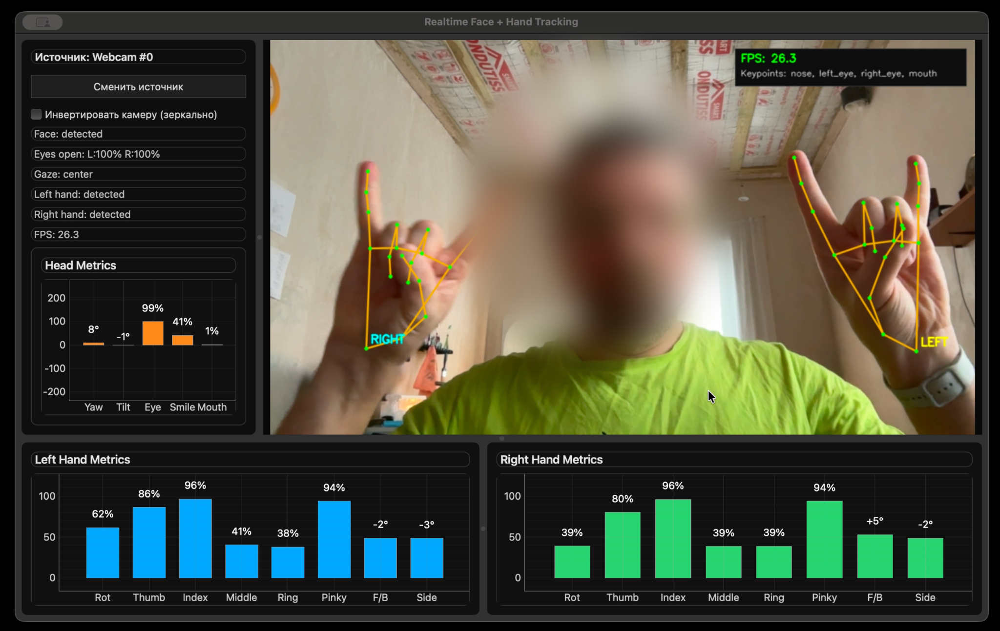

# Realtime Face + Hand Tracking



## Русский

### Описание
Десктоп-приложение на Python для трекинга лица и обеих рук в реальном времени через веб-камеру.

### Основной функционал
- Детекция лица и двух рук в реальном времени.
- Отображение видеопотока с оверлеями ключевых точек.
- Метрики рук (левая и правая отдельно):
  - `Rot`, `Thumb`, `Index`, `Middle`, `Ring`, `Pinky`, `F/B`, `Side`.
- Метрики головы:
  - `Yaw`, `Tilt`, `Eye`, `Smile`, `Mouth`.
- Метрика направления взгляда (`Gaze`).
- Проценты открытия глаз:
  - `Eyes open: L:XX% R:YY%`.
- Инверсия камеры (зеркальный режим):
  - корректно влияет на отображение,
  - корректно влияет на left/right подписи для рук и глаз.
- Выбор источника камеры:
  - если доступен ровно один источник, выбирается автоматически,
  - в главном окне есть кнопка `Сменить источник` для повторного выбора.
- Гибкая настройка интерфейса:
  - можно менять размеры окна,
  - можно менять размеры внутренних зон через splitter (панель, видео, блоки рук).
- Сохранение настроек интерфейса между запусками:
  - размеры окна,
  - размеры splitter-блоков,
  - состояние инверсии камеры.
- Устойчивое отображение графиков при потере данных:
  - при отсутствии новых данных столбики сохраняют последнее значение,
  - невалидные столбики окрашиваются в серый,
  - если рука пропала — весь график руки становится серым.

### Технологии
- Python 3.11+
- [uv](https://docs.astral.sh/uv/)
- OpenCV
- MediaPipe Tasks
- PySide6 (`pyside6-essentials`)
- pyqtgraph


### Запуск
1. Установка зависимостей:
```bash
uv sync
```

2. Запуск приложения:
```bash
uv run python main.py
```

3. Запуск тестов:
```bash
uv run pytest
```

### Лицензия
Проект распространяется под лицензией Apache 2.0. См. файл `LICENSE`.

---

## English

### Overview
A Python desktop application for real-time face and two-hand tracking using a webcam.

### Key Features
- Real-time face and two-hand detection.
- Live video stream with keypoint overlays.
- Hand metrics (separate for left and right):
  - `Rot`, `Thumb`, `Index`, `Middle`, `Ring`, `Pinky`, `F/B`, `Side`.
- Head metrics:
  - `Yaw`, `Tilt`, `Eye`, `Smile`, `Mouth`.
- Gaze direction metric (`Gaze`).
- Eye openness percentages:
  - `Eyes open: L:XX% R:YY%`.
- Camera inversion (mirror mode):
  - correctly affects rendering,
  - correctly updates left/right labels for hands and eyes.
- Camera source selection:
  - auto-selects when only one source is available,
  - includes a `Change source` button in the main window.
- Flexible layout resizing:
  - resizable main window,
  - resizable internal areas via splitters (panel, video, hand blocks).
- Persistent UI settings between runs:
  - window size,
  - splitter sizes,
  - camera inversion state.
- Robust chart behavior when data is missing:
  - bars keep the last valid value,
  - invalid bars are rendered in gray,
  - if a hand is lost, the whole hand chart turns gray.

### Tech Stack
- Python 3.11+
- [uv](https://docs.astral.sh/uv/)
- OpenCV
- MediaPipe Tasks
- PySide6 (`pyside6-essentials`)
- pyqtgraph


### Run
1. Install dependencies:
```bash
uv sync
```

2. Start app:
```bash
uv run python main.py
```

3. Run tests:
```bash
uv run pytest
```

### License
This project is licensed under Apache 2.0. See `LICENSE`.
